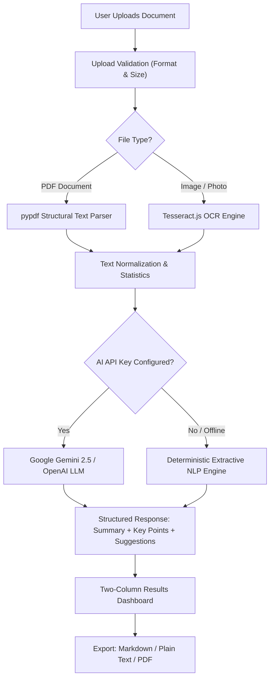

# DocuMind — AI Document Summary Assistant

A production-ready web application for extracting text from PDFs and scanned documents/images, analyzing document structures, and generating multi-depth summaries, key points, main ideas, and actionable improvement recommendations with both cloud LLM synthesis and high-performance offline extractive intelligence fallback.

---

## 1. Project Overview & Features

- **Dual-Engine Architecture**: Automatically leverages Google Gemini / OpenAI when configured, with seamless failover to an offline deterministic **Extractive NLP Engine** (TF-IDF + sentence scoring) when API keys are absent or offline.
- **Universal Document Ingestion**: Supports multi-page PDFs, PNG, JPG, JPEG, and WEBP documents.
- **Optical Character Recognition (OCR)**: In-browser accelerated OCR using Tesseract.js paired with server-side Pillow image binarization.
- **Multi-Depth Summaries**: Instant switching between **Short** (~80 words), **Medium** (~220 words), and **Long** (~450 words) with real-time recalculation.
- **Structured Intelligence Dashboard**:
  - **Executive Summary**: Coherent natural-language summary.
  - **Key Points**: Prioritized factual takeaways as interactive cards.
  - **Main Ideas**: Categorized core concepts and thematic tags.
  - **AI Improvement Suggestions**: 4 categories (*Missing Information*, *Needs Clarification*, *Review Topics*, *Follow-up Questions*).
  - **Searchable Extracted Text**: Raw text viewer with real-time substring filtering and word/character counters.
- **Export & Productivity**: 1-click export to Markdown (`.md`), Plain Text (`.txt`), and formatted Printable PDF, plus copy-to-clipboard actions.
- **Local Persistence**: Document history drawer storing past summaries in `localStorage` for 1-click restore.
- **Built-in 1-Click Samples**: Preloaded sample documents (Technical Assessment Spec, AI Research Paper, Business Agreement) for instant testing without uploading files.

---

## 2. Screenshots

```
+-------------------------------------------------------------------------+
|  [D] DocuMind                                [● AI Ready] [History] [⚙] |
|                                                                         |
|                     Understand your documents faster                    |
|       Upload a PDF or scanned document to extract text and insights     |
|                                                                         |
|    +---------------------------------------------------------------+    |
|    |                   Drop your document here                     |    |
|    |                 PDF, PNG or JPG up to 10MB                    |    |
|    |                                                               |    |
|    |                       [ Browse File ]                         |    |
|    +---------------------------------------------------------------+    |
|                                                                         |
|    Sample Demos: [Technical Spec]  [AI Research Paper]  [Business MSA]  |
+-------------------------------------------------------------------------+
```

---

## 3. Tech Stack

| Layer | Technology | Description |
|---|---|---|
| **Frontend** | React 18 + TypeScript | Component-driven reactive UI |
| **Styling** | Tailwind CSS | Clean Zinc & Emerald minimalist theme |
| **Build Tool** | Vite 6 | High-speed build and HMR development server |
| **Icons** | Lucide React | Clean, lightweight icons |
| **Client OCR** | Tesseract.js | In-browser OCR acceleration for scanned images |
| **Backend** | Python 3.10+ / FastAPI | Asynchronous REST API with auto OpenAPI schemas |
| **Server** | Uvicorn | High-performance ASGI server |
| **PDF Extraction** | pypdf | Layout parsing and structural healing |
| **Image Processing** | Pillow (PIL) | Contrast adjustment and boundary sharpening |
| **AI Providers** | Google Gemini (2.5/1.5) / OpenAI | Deep multi-depth document synthesis |
| **Fallback Engine** | Custom Python NLP | Offline TF-IDF sentence ranking & entity detection |
| **Testing** | Pytest + Starlette TestClient | Automated backend unit & API test suite |

---

## 4. Architecture

```
┌─────────────────────────────────────────────────────────────────────────────┐
│                            FRONTEND (React + Vite)                          │
│                                                                             │
│  ┌───────────────────────┐   ┌────────────────────┐   ┌──────────────────┐  │
│  │ Upload Dropzone & OCR │──>│ 4-Stage Stepper UI │──>│ Results Dashboard│  │
│  └───────────────────────┘   └────────────────────┘   └──────────────────┘  │
└──────────────────────────────────────┬──────────────────────────────────────┘
                                       │ POST /api/extract & /api/summarize
                                       ▼
┌─────────────────────────────────────────────────────────────────────────────┐
│                            BACKEND (FastAPI API)                            │
│                                                                             │
│  ┌───────────────────────┐   ┌────────────────────┐   ┌──────────────────┐  │
│  │ PDF Parser / OCR Eng. │──>│ Text Normalization │──>│ Metadata Compute │  │
│  └───────────────────────┘   └────────────────────┘   └────────┬─────────┘  │
│                                                                │            │
│                                 ┌──────────────────────────────┴─────────┐  │
│                                 ▼                                        │  │
│                     ┌───────────────────────┐                            │  │
│                     │ API Key Available?    │                            │  │
│                     └──────────┬────────────┘                            │  │
│                     YES        │         NO / Error                      │  │
│             ┌──────────────────┴──────────────────┐                      │  │
│             ▼                                     ▼                      │  │
│  ┌──────────────────────┐             ┌──────────────────────┐           │  │
│  │ Google Gemini / LLM  │             │ Extractive Fallback  │           │  │
│  │ (Multi-depth JSON)   │             │ (TF-IDF + TextRank)  │           │  │
│  └──────────────────────┘             └──────────────────────┘           │  │
└─────────────────────────────────────────────────────────────────────────────┘
```



---

## 5. How Document Processing Works

1. **Validation & Security**: File size boundary check (<10MB), supported extensions check (`.pdf`, `.png`, `.jpg`, `.jpeg`, `.webp`), and empty file detection.
2. **Text Extraction**:
   - **PDFs**: Parsed via `pypdf` with structural word re-assembly and page counting.
   - **Images**: In-browser OCR via `Tesseract.js` with server Pillow pre-processing fallback.
3. **Text Normalization**: Strips zero-width characters, heals line-wrapped hyphens, computes word/character count, and estimates reading time.
4. **Summarization**: Generates executive summary, key points, main ideas, and improvement suggestions via configured LLM or offline extractive NLP.

---

## 6. OCR Implementation

- **Client-Side Acceleration**: Leverages `Tesseract.js` worker threads in the browser to extract text directly on the user's device, providing real-time progress feedback.
- **Server Preprocessing**: If processed on backend, images are preprocessed with Pillow:
  - RGBA / Palette converted to RGB
  - Grayscale conversion (`L` mode)
  - Contrast enhancement (1.8x factor)
  - Edge sharpening filter to improve character recognition accuracy.

---

## 7. AI Summarization Implementation

- **Cloud Mode**: Prompts Google Gemini (`gemini-2.5-flash` / `gemini-1.5-flash`) or OpenAI (`gpt-4o-mini`) with strict JSON schema constraints.
- **Extractive Fallback Mode**: If no API key is provided:
  - Tokenizes words, filters stop-words, and calculates term frequency weights.
  - Scores sentences based on term density, position bonus (intro/conclusion bias), and statistical length normalization.
  - Returns top ranked sentences restored to chronological narrative order.
  - Generates key takeaways, core concept tags, and heuristic improvement suggestions.

---

## 8. Environment Variables

DocuMind runs out of the box with zero required environment variables. To enable cloud LLMs:

| Variable | Required | Default | Description |
|---|---|---|---|
| `GEMINI_API_KEY` | Optional | `""` | Google Gemini API Key ([Google AI Studio](https://aistudio.google.com/)) |
| `OPENAI_API_KEY` | Optional | `""` | OpenAI API Key |
| `PORT` | Optional | `8000` | Backend API port |
| `VITE_API_BASE_URL` | Optional | `"/api"` | Backend URL for production deployment |

---

## 9. Local Setup & Running

### Prerequisites
- Python 3.10+
- Node.js 18+

### Step 1: Clone Repository
```bash
git clone https://github.com/mtsssrinivas/23BCE7414_DocuMind-Document_Summary_.git
cd 23BCE7414_DocuMind-Document_Summary_
```

### Step 2: Running Backend
```bash
# Install dependencies
pip install -r backend/requirements.txt

# Start backend server
python -m uvicorn backend.main:app --reload --port 8000
```
Backend will run at `http://localhost:8000` (Docs at `/docs`).

### Step 3: Running Frontend
In a separate terminal:
```bash
cd frontend

# Install dependencies
npm install

# Start Vite dev server
npm run dev
```
Frontend will run at `http://localhost:5173`.

---

## 10. Automated Tests

Run backend unit and API integration tests:
```bash
python -m pytest -v tests/test_backend.py
```

---

## 11. Deployment Guide

### Frontend on Vercel
1. Import repository on [Vercel](https://vercel.com).
2. Set Root Directory to `frontend`.
3. Set Build Command to `npm run build` and Output Directory to `dist`.
4. Add Environment Variable: `VITE_API_BASE_URL` = `<YOUR_BACKEND_RENDER_URL>`.
5. Deploy.

### Backend on Render
1. Create a new **Web Service** on [Render](https://render.com).
2. Set Runtime to `Python 3`.
3. Build Command: `pip install -r backend/requirements.txt`.
4. Start Command: `uvicorn backend.main:app --host 0.0.0.0 --port $PORT`.
5. Add `GEMINI_API_KEY` under Environment Variables (optional).
6. Deploy.

---


